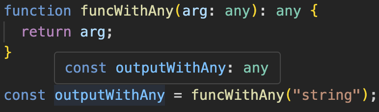
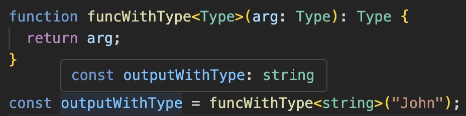
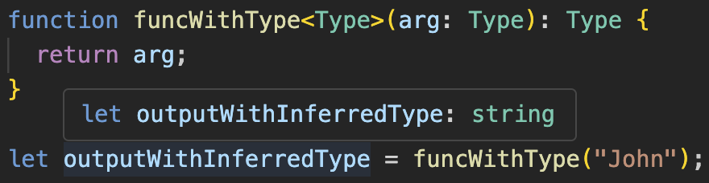
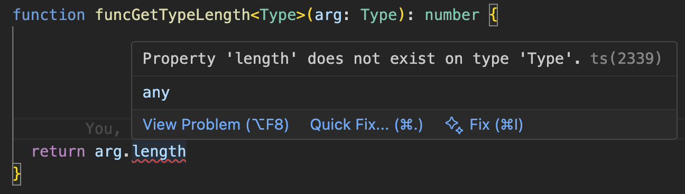
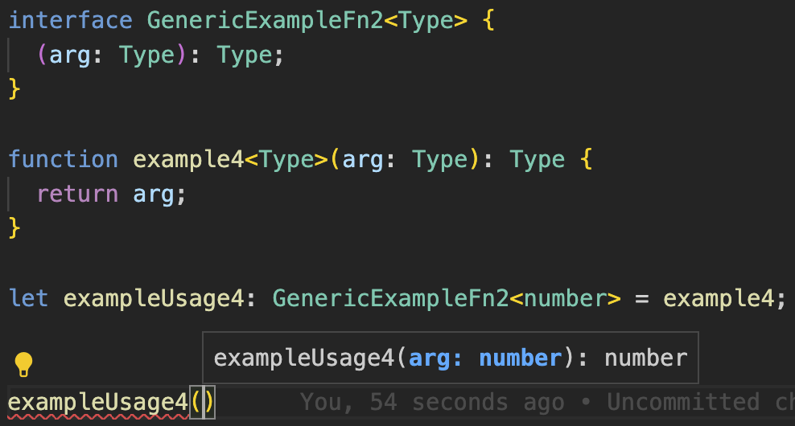
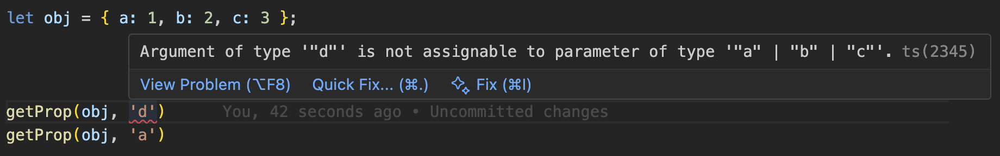
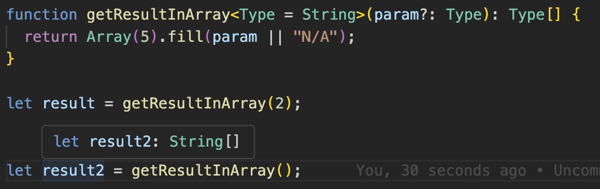

# POC TypeScript Generics

Generics help create reusable modules that are flexible to work with multiple types

## Generic Functions

To create a function that receives a generic argument, we could make use of `any` type, like:

```Typescript
function funcWithAny(arg: any): any {
  return arg;
}
```

but in that way, we lose the information about what type was passed when the function returns.
Whenever we call the function, the value assigned to the return value will always be `any`.



If we use a `Type` to the identity of the function, we can capture the type that was passed as argument to be used later, for exemple for the return type of the function:

```Typescript
function funcWithType<Type>(arg: Type): Type {
  return arg;
}
```

Now we can, for example, call the function setting Type to the type we want, by putting it wrapped with `<>`:



Or, we can just let TS infer the type:



When we set Generic Type variables, TS will enforce us to work with them as real generics, aka as they could be ANY type, so if you try to access something specific from a particular type, the compiler will give an error:



If we want to get the length of the param, we'll need to tell TS that we're receiving an array of Type. There are two ways of doing it:

```Typescript
function funcGetTypeArrayLength1<Type>(arg: Type[]): number {
  return arg.length
}

function funcGetTypeArrayLength2<Type>(arg: Array<Type>): number {
  return arg.length
}
```

## Typing Generic Functions

We can also create types for the functions themselves. The Generic type doesn't need to have the same name, as long as they have the same structure like:

```Typescript
function example<Type>(arg: Type): Type {
  return arg
}

let exampleUsage: <Input>(arg: Input) => Input = example
```

The generic type can also be written as an object:

```Typescript
let exampleUsage2: { <Type>(arg: Type): Type } = example;
```

Now we can move the object into a generic interface:

```Typescript
interface GenericExampleFn {
  <Type>(arg: Type): Type;
}

function example3<Type>(arg: Type): Type {
  return arg
}

let exampleUsage3: GenericExampleFn = example3
```

We can also move the generic parameter to be a parameter of the Interface. It helps to see which type it is generic over:



## Generic Classes

Generic classes can also have generic types as parameters, similar to Generic Functions

```Typescript
class GenericUtils<Type> {
  empty!: Type;
  sum!: (x: Type, y: Type) => Type;
}

let genericString = new GenericUtils<string>();
genericString.sum = function (x, y) {
  return x + y;
};

let genericNumber = new GenericUtils<number>();
genericNumber.sum = function (x, y) {
  return x + y;
};
```

## Generic Types With Knwon Properties

Sometimes there can be generic types for which we know some of their fields, or part of it

```Typescript
interface WithId {
  id: string;
}

function logId<Type extends WithId>(arg: Type): Type {
  console.log(arg.id)
  return arg;
}

logId({ id: "123", otherField: 456 });
```

Notice that as long as the parameter passed has an id, it is valid

## Using Constrains Based on other Generic Types

We can use constrains that are based on the Generic Types, for exemple, fi we want to extract a property from a Type

```Typescript
function getProp<Type, Key extends keyof Type>(obj: Type, key: Key) {
  return obj[key]
}

let obj = { a: 1, b: 2, c: 3};
```

TS will only allow us to call `getProp` by passing a key that actually exists in the object passed:



## Default Generic Parameter

We can also define default generic parameters on functions, so when the function is called without passing parameters, it assumes the generic types, making them more generic


